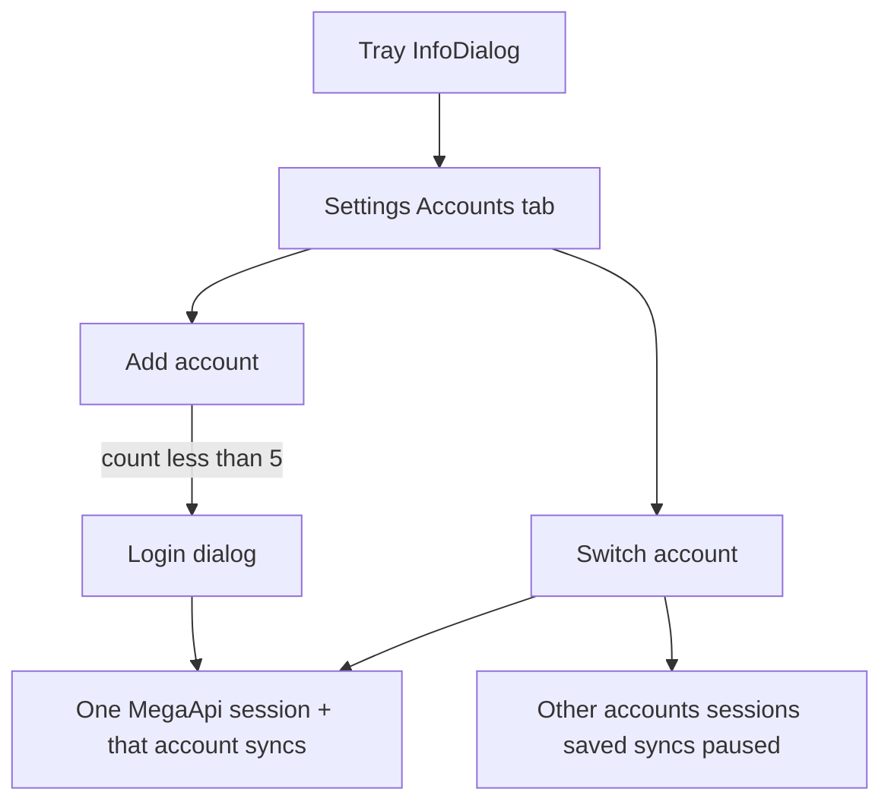

# Multi-account MEGAsync (one active, max 500)

**Status:** approved. Phase 1 clone done (`76c343ed9` + SDK). Toolchain missing on this PC (no VS, no Qt 5.15, no desktop CMake). Win11 ARM64 runs the x64 exe emulated.

**Product:** up to 5 saved accounts. One live MEGA session. Switcher pauses the other accounts’ syncs. Not two processes at once.

## Building phases

Do not start a later phase until the gate on the one before passes.

**Phase 1 — Stock x64 exe (gate)** ~2–8 h  
Clone MEGAsync + SDK submodule. Keep this PLAN.md. CMake `-A x64`, Qt 5.15 MSVC x64, vcpkg. Build target `MEGAsync` only.  
**Gate:** `MEGAsync.exe` launches on this PC and one login works.

**Phase 2 — Strip** ~4 h  
`ENABLE_EXPLORER_EXT=OFF`, updater off. No `HTTPServer`, no Stream UI, no Upgrade/Buy more space/Discount/WhatsNew.  
**Gate:** rebuild runs; no HTTP_PORT listener; those UI bits gone.

**Phase 3 — Account switcher** ~1–2 days  
Max 5 slots. Keep-session switch. Settings Accounts tab + tray submenu. One process, one `MegaApi`.  
**Gate:** add account 2, switch back, only one account syncs.

**Phase 4 — Verify** ~1 h  
Two to five accounts on Win11 ARM64 (x64 emulation). Cap at 5. Remove inactive. Second exe does not start.

Licence: MEGA Limited Code Licence is non-commercial. Keep LICENCE.md. One active session is the T&C-safer shape. Do not publish a GitHub fork until you ask.

## UX (locked)

One tray, one process, one `MegaApi`. Stock MEGAsync already stores per-user prefs (`Preferences::getNumUsers` / `enterUser` / `leaveUser`) but logout is `unlink()` (drops the session). We add **keep-session switch** and a list UI. Cap **5**.

### Tray

Tooltip: `MEGAsync — alice@example.com (2 of 5)`

InfoDialog header shows **active email** (and avatar). New control: **Accounts** opens Settings on the Accounts tab.

Tray context menu:

- Accounts
  - alice@…  Active
  - bob@…  Switch
  - Add account…  (grey at 5)
- Settings
- Exit

Second app launch: existing single-instance lock (`megasync.lock` in the one data dir). Show the running tray. Never start a second process.

### Settings → Accounts tab

One row per saved account:

- Avatar, email, Active or Inactive
- Inactive: last used date, “N syncs paused”
- Active: **Switch** disabled, **Log out** (existing unlink: drops this session, does not delete other saved accounts)
- Inactive: **Switch**, **Remove** (delete that slot’s session + cached user prefs; local folders stay on disk)
- Footer: `2 of 5 accounts` and **Add account**

### Add account

1. If already at 5: toast “Maximum 5 accounts.” Stop.
2. Confirm: “Sign in to another account? Sync for alice@ will pause. You can switch back later.”
3. Dump current session; do **not** `unlink()` the current user slot.
4. `megaApi` logout keep-session (same idea as MEGAcmd `logout --keep-session`).
5. Pause/disable current account syncs in the SDK.
6. Open existing login/onboarding.
7. New login becomes the active slot. Count += 1.

Reject duplicate email already in the list.

### Switch

1. Confirm: “Switch to bob@? alice@ will stop syncing until you switch back.”
2. Keep alice session in prefs. Pause alice syncs. Local files stay.
3. Logout MegaApi without wiping alice’s stored session.
4. `enterUser(bob)` + `fastLogin(bob session)` + fetch nodes + resume bob’s saved syncs.
5. If bob’s session was killed on the web: show login for bob only; other slots stay.

Startup: last active email fast-logins. Inactive slots stay stored and idle.

### What the user sees on disk

Each account keeps its own sync folder paths (already per-user in Preferences). Inactive account folders just sit there. No background upload/download for them. One account “owns” live file watching.

### Rejected UX

- Two trays / `--profile a` and `--profile b` at once.
- Five Start-menu shortcuts that can all run.
- One window with two live sessions.

## Stack still locked

- x64 like GitHub; Win11 ARM64 emulation.
- No `HTTPServer`.
- No Explorer overlays/menus (`ENABLE_EXPLORER_EXT=OFF`).
- No Upgrade / Buy more space / DiscountPolicy / WhatsNew / Stream from MEGA.
- No official updater (`ENABLE_DESKTOP_UPDATER=OFF`).
- One data dir: `%LocalAppData%\Mega Limited\MEGAsync`.

Quit official MEGAsync while testing. Same data dir and lock file collide.

## 1. Clone and first x64 build

Preserve PLAN.md:

1. Move PLAN.md aside.
2. `git clone --recurse-submodules https://github.com/meganz/MEGAsync.git D:\WEBSITES\MegaSync`
3. Put PLAN.md back at the repo root.

CMake: VS 2022 `-A x64`, Qt 5.15 MSVC x64, vcpkg. Flags: `ENABLE_EXPLORER_EXT=OFF`, `ENABLE_DESKTOP_UPDATER=OFF`, `ENABLE_DESKTOP_UPDATE_GEN=OFF`, `ENABLE_DESKTOP_APP_TESTS=OFF`.

Stop: `MEGAsync.exe` launches, one login works. Switcher code only after that.

## 2. Account switcher (the feature)

New thin controller on top of [LoginController.cpp](https://github.com/meganz/MEGAsync/blob/master/src/MEGASync/control/LoginController.cpp) / [MegaApplication](https://github.com/meganz/MEGAsync/blob/master/src/MEGASync/MegaApplication.cpp):

- Slot list: email, last-active, keep session string (already in Preferences user sections).
- Hard cap 5.
- `switchTo(email)` / `addAccount()` / `removeAccount(email)` as above.
- Never call full `MegaApplication::unlink()` on switch; that path stays for **Log out** of the active account only.
- Global lock unchanged (one data dir).

UI: Settings Accounts tab + tray submenu. No second process.

## 3. Strip Explorer / upsell / stream / HTTPServer

- No ShellExt; hide overlay checkbox; `overlayIconsDisabled` true.
- Hide `bUpgrade` / `bBuyQuota`; `upgradeClicked()` no-op; no UpsellDialog; no DiscountPolicy; skip WhatsNew; stub check-for-updates.
- No `StreamingFromMegaDialog`; no SDK HTTP streaming start.
- Do not construct `HTTPServer` in MegaApplication.

## 4. Verify

1. Login account 1, add a sync folder, files sync.
2. Add account 2; confirm account 1 syncs stop; account 2 can add its own folder.
3. Switch back to 1; 1 resumes; 2 idle.
4. Add up to 5; 6th Add is blocked.
5. Remove an inactive account; its session is gone; files on disk remain.
6. Second `MEGAsync.exe` does not start a second session.
7. No Upgrade / Stream / overlays from this build; no HTTP_PORT listener.

## Time

- Clone + first x64 build: 2–8 hours.
- Keep-session switch + Accounts tab + tray: ~1–2 days after a working build.
- Strip shell / upsell / stream / HTTPServer: ~4 hours.
- Switch verification: ~1 hour.
